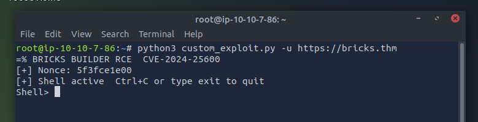

# Bricks Heist THM Walkthrough — CVE-2024-25600 & More

---
## Author

## What I did

Created a custom exploit for Bricks Builder RCE (exploit code is in a private repo).  
Extracted the nonce from the homepage JavaScript.  
Sent PHP wrapped in an Exception to get command output.  
Obtained shell access and found a hidden `.txt` flag.  
Identified a suspicious process `nm-inet-dialog` and related service.  
Located miner config file and extracted the wallet address.  
Used OSINT to connect the wallet to a known threat group.

---

## How I did it

Developed a Python script targeting the vulnerable REST API endpoint.  
Used an interactive shell to run commands and retrieve output.  
Explored running processes, systemd services, and log files.  
Analyzed miner config and gathered intelligence.  
Collected all flags and relevant information.
